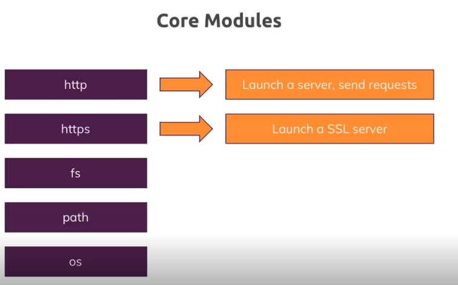

1. In nodejs we write the code which runs on the server
2. The code can communicate with the database which sometimes runs on a separate server
3. After running the logics we send a response back to the client
    - The response can be HTML text/code/file/json/xml data
    - The response is handled by the client
4. The request and response transmission is done through a protocol (**HTTP**/**HTTPS**)

5. In HTTPS, SSL Encryption is turned on, where all the data that is transmitted is actually encrypted, so even if anyone is spoofing, they can't read the data.

Core Modules



## HTTP
- HTTP `createServer` method takes a `requestListener` function as an argument
- This function would execute for every incoming request
- The requestListener also takes 2 arguments which are request and response.
- The createServer method returns a server

## What is the Header of the Response?

In HTTP communication, response headers are metadata sent by the server to the client (browser or API consumer) along with the actual response body. These headers provide extra information about the response.
```
HTTP/1.1 200 OK
Content-Type: text/html
Content-Length: 1234
Cache-Control: no-cache
Set-Cookie: sessionId=abc123; Path=/
```

- Content-Type: Specifies the type of content (e.g., text/html or application/json).
- `res.end()` is a method used in Node.js HTTP servers to end the response and signal that all data has been sent to the client.
- It terminates the response stream, meaning no more data can be sent after calling it.
- It can optionally send some data before ending the response.